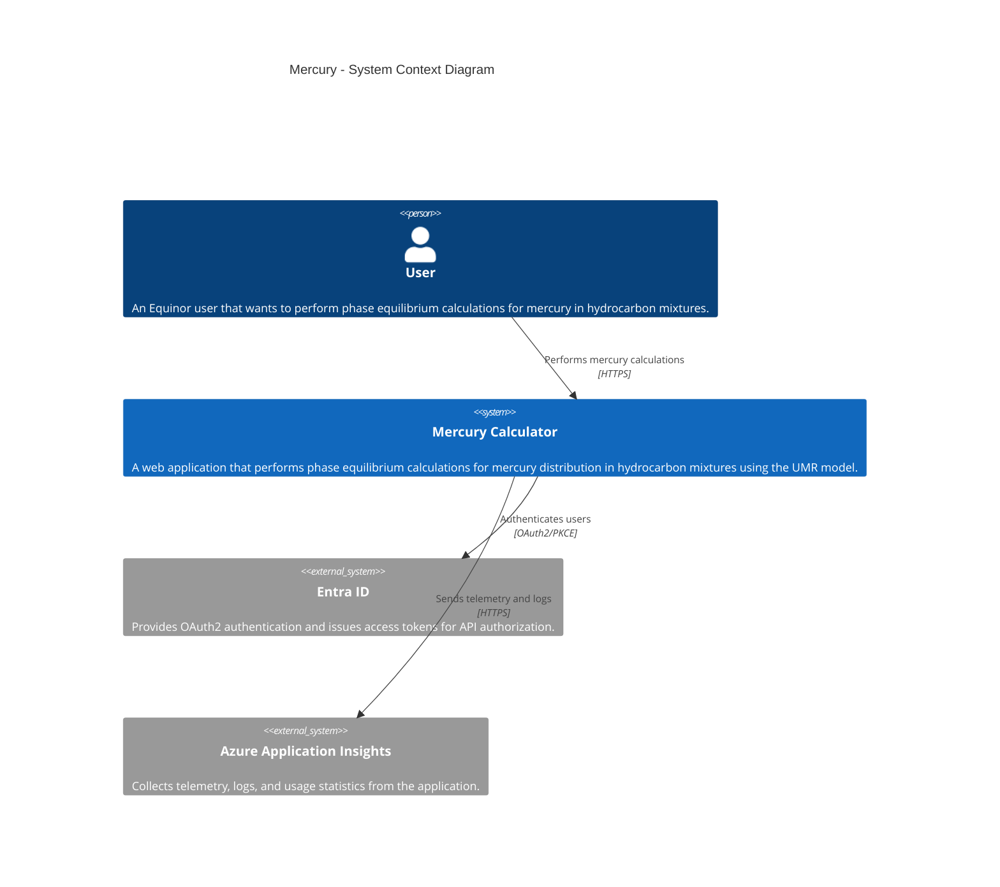
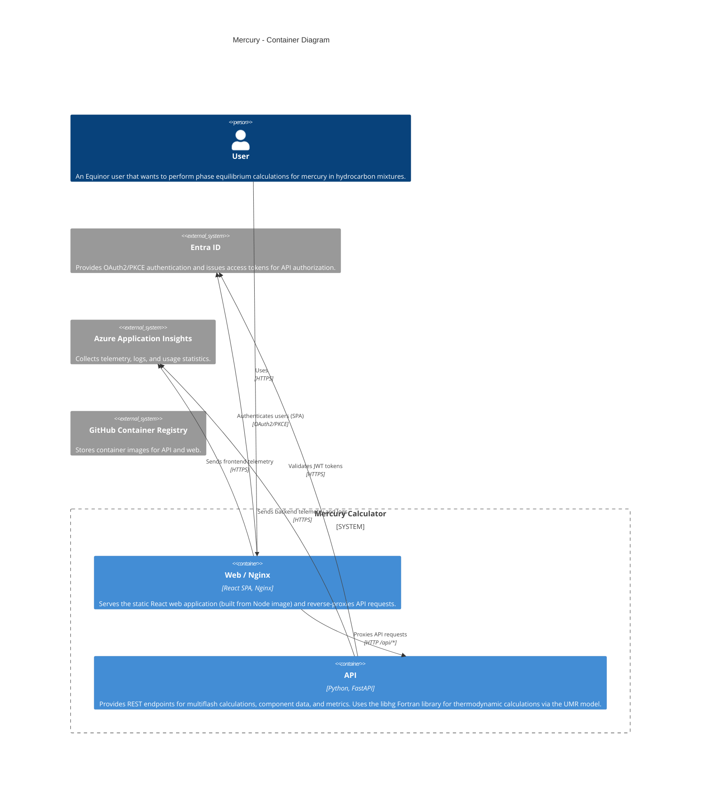
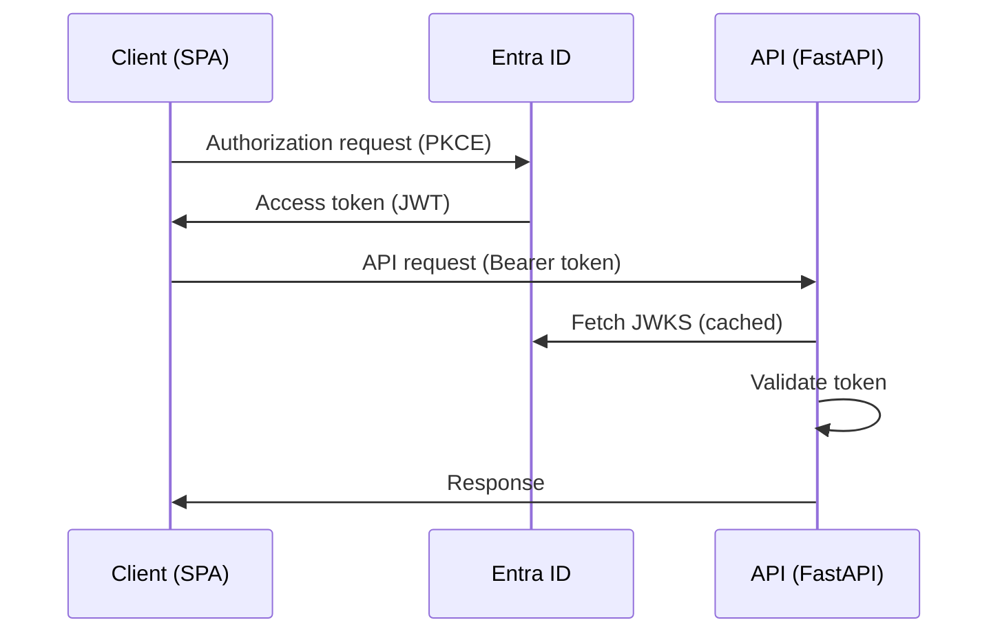

# Mercury Runbook

This document covers operational information about the Mercury Calculator and should be used to understand how the system is configured and functions, including how to perform deployments, updates, and incident responses.


## Links

> _Quick access to essential resources and communication channels related to the application's development and operation._

- [GitHub Repository][github-repository]
- [GitHub Team][github-team]
- [GitHub Project][github-project]

See [resources](#resources) section for overview of all resources used by the application.

## Overview Platforms
>
> _Quick overview of all platforms used._

- [ ] [DRM](https://drm.equinor.com/)
- [ ] [Omnia Classic](https://docs.omnia.equinor.com/products/Service-Offerings/#omnia-classic)
- [ ] [Omnia Standalone](https://docs.omnia.equinor.com/products/Service-Offerings/#omnia-standalone)
- [x] [Omnia Radix](https://www.radix.equinor.com)


## Prerequisites
> _List of all necessary permissions, or knowledge required to perform the tasks described in this runbook._

<details>
    <summary>Permissions required </summary>

* **For Managing Radix**
 * To access the Radix console
    * Apply for the `Radix Platform Users` and `Radix Playground Users` through [AccessIT](https://accessit.equinor.com)
    * Added to the [Team Hermes Radix Admin][radix-admin-group] group that controls who can administrate the Radix application.
  * To change the `radixconfig.yaml` file
    * Added to the [GitHub repository][github-repository]
*  **For Managing Azure Resources**
  * To access Azure resources, apply for the `Owner` and/or the `Contributor` role in the `S538-NeqSim API` subscription through [AccessIT](https://accessit.equinor.com) or get added to the `mercury-dev` / `mercury-prod` AZ groups.
</details>

<details>
    <summary>Competence required </summary>

* [Radix](https://www.radix.equinor.com)
* [Docker](https://docs.docker.com/)
* [Azure](https://learn.microsoft.com/en-us/azure/)
* [React](https://react.dev/)
* [yarn](https://yarnpkg.com/)
* [Python](https://www.python.org/)
* [Oauth2](https://oauth.net/2/)
* [Pre-commit](https://pre-commit.com/)
* [Git](https://git-scm.com/)
* [GitHub Actions](https://docs.github.com/en/actions)

</details>


## Architecture Diagrams

_We are using [C4 model][c4-model] for showing architecture diagrams._


<details>
  <summary>Level 1 - System Context diagram</summary>

> _Provides a high-level overview of the system, including its purpose, main components, and how these components interact._



</details>


<details>
  <summary>Level 2 - Container diagram</summary>

> _Provide an overview of the containers (runnable and deployable units) that executes code or stores data._



</details>


<details>
  <summary>Authentication Flow</summary>

The application uses the Authorization Code Grant Flow with Proof Key for Code Exchange (PKCE). It enables users to safely log in, consent to permissions, and fetch an access token in JWT format. The access token is attached to API requests as a Bearer token, which the API validates.



</details>

## Resources
> _List of all resources used by the application_


<details>
    <summary>Radix </summary>

| Name                                             | Description                          |
|--------------------------------------------------|--------------------------------------|
| [Radix Application][radix-application-console]   | The application registered in Radix. |

The configuration for our Radix app is in [radixconfig.yaml](./radixconfig.yaml).
There are two environments in Radix for Mercury: development (`dev`) and production (`prod`).


</details>


<details>
    <summary>Azure </summary>

#### Subscription
All resources for Mercury in Azure are under the `S538-NeqSim API` subscription.
These resources are defined in the [bicep](https://learn.microsoft.com/en-us/azure/azure-resource-manager/bicep/)
_Infrastructure-as-Code_-language for Azure. The bicep file can be found at [`./IaC`](./IaC).


#### Authentication

Authentication are handled by Microsoft Entra ID, which issues access tokens used to access the protected API endpoints. The App Registration created for this project is `Mercury`. 

#### Logging

The Application Insight resource has been placed in environment separated Resource Groups; `mercury-dev`, and `mercury-prod`.
These resources can be recreated by running the [IaC script](https://github.com/equinor/Mercury/tree/main/IaC)


>
 ```
 // See number of calculations

customEvents
| where name == "CalculationStarted"
```

>
 ```
 // See number of unique visitors

customEvents
| where name == "MainPageLoaded"
| distinct user_Id
```

</details>


<details>
    <summary>Secrets, Certificates and Keys</summary>

> _Overview of all secret and certificates used in the application_
 
`LIBHG_PAT`: A secret used to access the private repository `github.com/equinor/gpa-libhg` stored in Github and used during build of the API container image. The repository contains the Fortran library that is compiled and used for thermodynamic calculations in the API. 

When running the application locally, this secret needs to be created as a PAT from [https://github.com/settings/personal-access-tokens](https://github.com/settings/personal-access-tokens) and then added to the environment variables.

</details>


<details>
    <summary>REST API</summary>

The REST API is a basic Python FastAPI web server.
All configuration parameters are expected to be environment variables, and are defined in this file [config.py](https://github.com/equinor/Mercury/blob/main/src/config.py).

Note that the API Dockerfile needs read access to the private repository [github.com/equinor/gpa-libhg](https://github.com/equinor/gpa-libhg) during build.
This repository keeps the Fortran library that is compiled and created Python bindings for.

Logs and detailed request information are exported to _Azure Application Insight_

A container image is available at `ghcr.io/equinor/mercury-api`.
</details>

## Administrative Tasks
> _Higher-level tasks associated with managing and configuring the system._

<details>
    <summary>Environments and Resources Management </summary>


**Radix Environments**

> Describe how to configure and deploy Radix environments.

Configurations of Radix environments can be adjusted by modifying the `radixconfig.yaml` file in the [GitHub repository][github-repository].

Outlined below are descriptions of each environment with their respective deployment strategies.

| Environment            | Deployed how?                                                                            |
|------------------------|------------------------------------------------------------------------------------------|
| [Development][dev-url] | Automatically deployed from every commit to the main branch on GitHub                    |
| [Production][prod-url] | Automatically deployed when the release-please PR is merged                               |

How to deploy to development environment:

  1. Create a pull request to main branch and assert that all checks passes.
  2. Merge the pull request and follow conventional commits for commit message.
  3. The development environment in Radix will now be built and deployed automatically.

</details>

<details>
   <summary>Firewall and Network Configuration</summary>

> _Overview of network configurations and firewall rules._

Firewall is configured through [Access & Network Services][access-and-network-services]

</details>


<details>
    <summary>Security Management</summary>

> _Identifying, review and apply security patches._

**Security Checks**


**Monitoring and Managing Vulnerabilities**

* CodeQL is used to monitor and manage security vulnerabilities in the application.
* Dependabot is used to monitor and manage dependencies in the application.


**Penetration Tests**

**Threat Modelling Sessions**


</details>


## Operational Tasks
> _Routine activities required to keep the system running smoothly._

<details>
    <summary>User Management</summary>

> _Adding or removing users. Managing permissions and access controls._
</details>


<details>
    <summary>Monitoring System Health and Usage Statistics</summary>

> _Describe how the system health and security monitoring is performed._

* Application status and logs can be monitored via the [Radix Application Console][radix-application-console], and you can also navigate from there to Grafana dashboard to monitor application performance and resource utilization.
* Usage statistics of site traffic, inspect applications logs for errors or unusual activity is available in `Application Insights`:
  - [dev][dev-application-insights]
  - [prod][prod-application-insights]

</details>


<details>
    <summary>Backup and Recovery</summary>

> Provide overview of backup schedules, restoration steps, and responsible personnel.

**How backups is performed**

**How to verify backups for integrity**

**Recovery procedures**


</details>

<details>
    <summary>Security Incidents</summary>

> Describe how information security incidents are handled.

Security Incidents should be reported at [Equinor's Computer Security Incident Response Team][eq-csirt] as soon as identified.

</details>

<!-- codespell:ignore-start -->
[github-repository]: https://github.com/equinor/mercury
[github-team]: https://github.com/orgs/equinor/teams/team-hermes
[github-project]: https://github.com/orgs/equinor/projects/152
[radix-admin-group]: https://portal.azure.com/#view/Microsoft_AAD_IAM/GroupDetailsMenuBlade/~/Overview/groupId/13b319d8-ee25-4b6b-97db-74bad07d2057
[radix-application-console]: https://console.radix.equinor.com/applications/mercury
[dev-url]: https://proxy-mercury-dev.radix.equinor.com/
[prod-url]: https://mercury.app.radix.equinor.com/
[access-and-network-services]: https://ans.equinor.com/Applications?searchText=MERCURY+CALCULATOR&eAppID=119806
[radix-application-console]: https://console.radix.equinor.com/applications/mercury
[dev-application-insights]: https://portal.azure.com/#@StatoilSRM.onmicrosoft.com/resource/subscriptions/f196e45a-a78b-4d35-ba40-b354140bc7a1/resourceGroups/mercury-dev/providers/Microsoft.Insights/components/mercury-dev-logs/overview
[prod-application-insights]: https://portal.azure.com/#@StatoilSRM.onmicrosoft.com/resource/subscriptions/f196e45a-a78b-4d35-ba40-b354140bc7a1/resourceGroups/mercury-prod/providers/Microsoft.Insights/components/mercury-prod-logs/overview
[eq-csirt]: https://www.equinor.com/about-us/csirt
[c4-model]: https://c4model.com/


<!-- codespell:ignore-end -->
